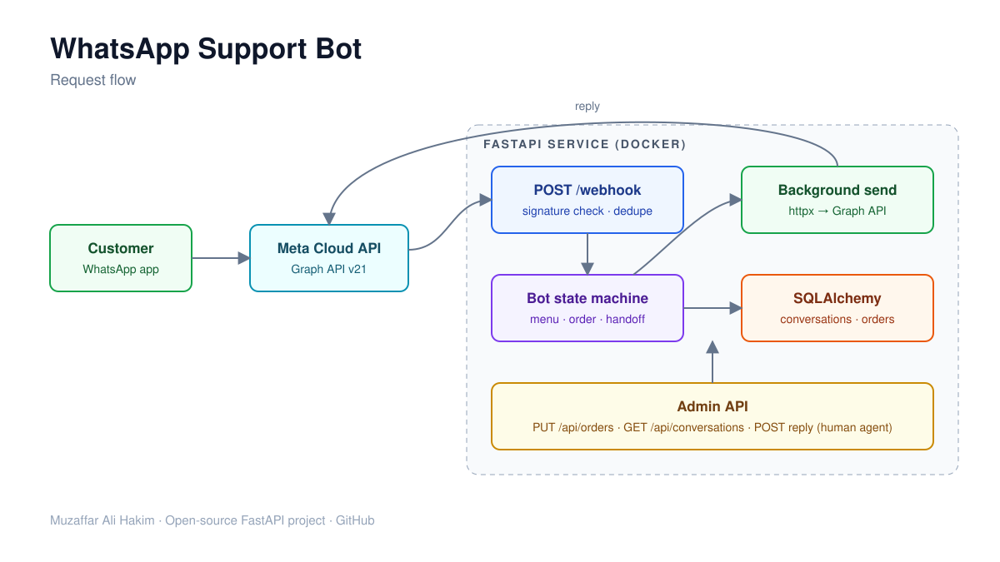

# WhatsApp Support Bot (FastAPI)


  

A customer-support chatbot for the **WhatsApp Cloud API**, built with **Python, FastAPI and SQLAlchemy**.
Customers message your business number and the bot answers instantly: order tracking, business hours, and handoff to a human agent.



## Features

- **Webhook verification** handshake (`GET /webhook`) and **signature checks** on every delivery (`X-Hub-Signature-256`, HMAC-SHA256)
- **Menu-driven conversation** with per-user state stored in the database (SQLite by default, any SQLAlchemy URL works)
- **Order tracking**: customer sends an order number, bot replies with status and ETA
- **Human handoff**: the bot goes quiet, agents list waiting chats and reply through the admin API
- **Idempotent**: WhatsApp can deliver a webhook twice; processed message ids are stored so customers never get double replies
- **Fast 200 responses**: replies are sent in a background task so Meta never times out and retries
- Supports text messages and interactive **button / list replies**
- **Tests** with pytest and respx (no real WhatsApp calls), Docker image, GitHub Actions CI

## Conversation flow

```
Customer: hi
Bot:      Hi Ali! Welcome to Acme Store.
          1. Track my order  2. Business hours  3. Talk to a person
Customer: 1
Bot:      Please send your order number (for example: A1001).
Customer: A1001
Bot:      Order A1001 is out for delivery. Expected delivery: today by 6 PM.
```

## Run it

```bash
cp .env.example .env          # fill in your Meta credentials
docker compose up --build
```

Or locally:

```bash
pip install -r requirements-dev.txt
uvicorn app.main:app --reload
pytest -q
```

Open **http://localhost:8000/docs** for the Swagger UI.

### Connect it to WhatsApp

1. Create an app at developers.facebook.com and add the **WhatsApp** product.
2. Copy the access token, phone number ID and app secret into `.env`.
3. Expose your server over HTTPS (for local testing: `ngrok http 8000`).
4. In **WhatsApp > Configuration**, set the callback URL to `https://<your-host>/webhook`, use your `WHATSAPP_VERIFY_TOKEN`, and subscribe to the `messages` field.

## API

| Method | Endpoint | Description |
| --- | --- | --- |
| GET | `/webhook` | Meta verification handshake |
| POST | `/webhook` | Incoming messages (signature checked) |
| PUT | `/api/orders` | Create or update an order the bot can report on |
| GET | `/api/conversations?handed_off=true` | Chats waiting for a human |
| POST | `/api/conversations/{wa_id}/reply` | Send an agent reply to the customer |
| GET | `/health` | Health check |

> The admin endpoints have no auth in this demo. Put them behind your API gateway, VPN or add an API key before going live.

## Project structure

```
app/
├── main.py       # FastAPI routes, webhook handling, background sends
├── bot.py        # conversation state machine (pure, easy to test)
├── whatsapp.py   # Graph API client, signature check, payload parsing
├── models.py     # SQLAlchemy models: Conversation, Order, ProcessedMessage
├── schemas.py    # Pydantic request/response models
├── db.py         # engine and session
└── config.py     # settings from environment variables
tests/            # pytest: webhook, bot flow, Graph API client
```

## License

MIT
